# Hintful diff format - Spec & Motivation

## Design goals

1. As far as possible, retain the good properties of unified diff format.
   Unified diff format files are:
   1. Usable for patching:<br/>
      Given a diff file in unified diff format and the old tree, it is possible to produce the new tree exactly.
   1. Usable for reverse patching:<br/>
      Given a diff file in unified diff format and the new tree, it is possible to produce the old tree exactly.
   1. Reversible:<br/>
      Given only a patch (diff) file from A to B, it is possible to produce a patch file from B to A.
   1. Content agnostic:<br/>
      Unified diff format itself has no regard to the syntax, or lack of syntax, of the content.
   1. Simple to implement producers and consumers for.
   1. Easy to mentally parse:<br/>
      Most of the meaning of one line can often be discerned without much context.
   1. Free from escaping hassle.<br/>
      Only newlines are handled specially.
   1. Often transparent to text encoding conversion:<br/>
      If you convert the source and patch (diff) files to another text encoding, the patch still produces the correct result provided that all source files are text.
      In many situations, it is also possible to thereafter convert the resulting files back to the original text encoding, and receive the same result as by applying the original patch with no conversion.
   1. Binary compatible:<br/>
      A patch can express differences between binary files and still be correctly applied, even though the patch file might not be readable as text.
      In some sense, unified diff format is not exactly, or not only, a text format.
1. Enable meaningfully expressed changes in any language, including for example
    1. Differences with finer granularity than one line
    1. Moving, copying and otherwise refactoring code
    1. Several independent differences that change the same line
    1. One and the same operation that affect several lines and files
    1. Any combination of the above.
1. Compatible with already existing tooling:<br/>
   It should be possible to use e.g. the *current version* of `git apply` to apply a hintful patch.

## Specification

The unified diff format has many nice properties and enjoys at least as much popularity as it deserves.
Unfortunately, it is implemented in different incompatible ways in different tools.
Bridging this gap with [one standard to rule them all](https://xkcd.com/927/) is not within the purpose or scope of this project.
Instead, this specification
* is expressed in terms of extending unified diff format.
* uses the `git` flavour of unified diff format as an example whenever talking about incompatible aspects.

Tags on the form `[HDFxx]` are used to map the specification to error codes in [ERROR-CODES.md](ERROR-CODES.md).

### Hintful hunk format

A hintful hunk consists of a one-line hunk header `[HDF11]` followed by any number of content lines, snippet activation lines and snippet deactivation lines `[HDF12]`.
The hunk header has the following grammar:

```EBNF
hintful_hunk_header = header_start , extension , header_end;

header_start        = "@@" , ws , "+" , line_count_info , ws;
extension           = "^"* , line_count , "\"? , ws;
header_end          = "-" , line_count_info , ws "@@" , comment , newline;

line_count_info     = start_line , [ "," , line_count ];
start_line          = integer;
line_count          = integer;
ws                  = " "+;
```

So the hintful hunk header looks just like a unified diff hunk header, except the `extension` in the middle which has the following functions:
* The caret (`^`) indicates the number of snippet columns.
* The integer indicates the number of lines in the hunk, excluding the header.
* The backslash (`\`) indicates that content lines will have newline markers.
* The presence of the extension causes legacy tools expecting unified diff format to exit with an error.

A content line consists of
* A number of snippet markers equal to the number of snippet columns.
  Each snippet marker is either:
  * An equals sign (`=`) indicating that the content is found in the snippet that is active for that column.
    This is only legal for active snippet columns `[HDF14]`.
  * A period (`.`) indicating that the content is not found in the snippet that is active for that column.
* A status marker, which is one of the following (the three first already supported by unified diff):
  * A minus (`-`) meaning the content is found only in the old file.
  * A plus (`+`) meaning the content is found only in the new file.
  * A space (` `) meaning the content is found in both the old and the new file.
  * An underscore (`_`) having the same meaning as space, except signaling that the content is not patch context, and is less interesting for human consumption.
  * A hash (`#`) meaning the content is found in neither the old nor the new file.
* Text content
* A newline marker, if it is supposed to be present.
  It is one of the following:
  * A backslash (`\`) signifying end of content.
    The rest of the content line, including the newline, is to be ignored.
  * A dollar sign (`$`) meaning the rest of the content line including the newline is part of the content.
    The dollar sign itself is not part of the content.
* Any number of CR characters and a newline character.

A snippet activation line consists of
* A number of snippet markers equal to the number of snippet columns.
  Each snippet marker is either:
  * A caret (`^`) indicating the activation of a named snippet for that column.
    The snippet remains active until explicitly deactivated, another snippet is activated for that column, or the hunk ends.
    At least one of the snippet markers must be a caret (`^`).
  * A comma (`,`) indicating no change for that snippet column.
* A colon (`:`).
* The name of the snippet.
  A snippet name must not include any CR or newline characters.
* Any number of CR characters and a newline character.

A snippet deactivation line consists of
* A number of snippet markers equal to the number of snippet columns.
  Each snippet marker is either:
  * A dollar sign (`$`) indicating the deactivation of the named snippet for that column.
    At least one of the snippet markers must be a dollar sign (`$`).
  * A comma (`,`) indicating no change for that snippet column.
* A colon (`:`).
* Any number of CR characters and a newline character.

Additionally, the following restrictions apply:
* A snippet name may be used several times, but the content must be the exact same every time the same snippet name is used, throughout a hintful diff file `[HDF15]`.
* Any occurrence of a `\r*\n` sequence in effective content (named snippet content or old or new file) must be represented by a `\r*\n` sequence in the hintful diff format file `[HDF16]`.
* The syntax `\ No newline at end of file` as used in unified hunks is forbidden `[HDF17]`.
* The constraints on where hunks begin and end are the same for hintful and unified hunks `[HDF18]`.

### Hintful diff format

The hintful diff format is an extension of the unified diff format.
The exact meaning of "unified diff format" is unfortunately implementation dependent.

The extensions are as follows:

#### File comparisons

A "file comparison" is a section of a diff format file with a header `[HDF21]` indicating what files are compared, potentially followed by a number of extended header information `[HDF22]`, and a series of hunks.
If the file header begins with `diff --git`, the following series of hunks must all be in unified hunk format `[HDF23]`.
If instead the file header begins with `diff --hintful`, the following series of hunks can be in an arbitrary mix of unified and hintful hunk format.
Within a file comparison, the hunks must be nonoverlapping and ordered by line number, both for the old and the new side `[HDF24]`.

#### Prefixed file comparisons

File comparisons can be prefixed or unprefixed.
A line is prefixed by a bar character (`|`) if and only if it belongs to a prefixed file comparison `[HDF31]`.
A prefixed file comparison must have a corresponding unprefixed version of the file comparison occurring later in the hintful diff format file `[HDF32]`.
All other duplication of file comparisons is forbidden `[HDF33]`.
Any or all extended headers and hunks may be missing from the prefixed version of the file comparison.
Any extended headers present in the prefixed version must also be present `[HDF34]` in the unprefixed version and match exactly `[HDF35]`.
Any hunks present in the prefixed version must have a corresponding hunk in the unprefixed version `[HDF36]`.
The corresponding unprefixed hunk may be expressed with a different format or in a different way, but must have matching effective content for the old and new side of the comparison `[HDF37]`.

Tools designed to consume hintful diff format should prioritize the semantic information in the prefixed version over that in the unprefixed.

### Compat format

The compat diff format is a subset of the hintful diff format, defined by one added constraint:
No unprefixed hunks may use the hintful hunk format `[HDF41]`.

A compat diff format file can be used as-is by tools designed to consume unified diff format.

## Motivation

### Hintful hunk header

The placement of the extension is designed to cause tools that don't support hintful hunks to exit with an error if they come across an unprefixed, hintful hunk.

The hunk line count is included since it is necessary for parsing.
The line counts for old and new files are redundant information, but they are left as they are since they
* Don't have any clear downside
* Could aid human consumption
* Could potentially make it easier to extend some consuming tools.

### Status marker minus (`-`), plus (`+`) and space (` `)

These status markers are the same as in unified diff.
There is no reason to change them.

### Hunk limits

Unified and hintful diff format have the same requirements for where hunks can begin and end:
* Hunks must start at the beginning of a line.
* Hunks must end after a newline or at the end of a file.

There are two reasons why hintful hunks must follow the same requirements for hunk limits as unified hunks.

First, this is required in order to be able to convert both ways between hintful and unified diff formats given only the diff file.

Second, due to the combination of three of our goals, namely transparency to text encoding conversion, binary compatibility and meaningfully expressed changes.
Since we want the format to be able to deal with content that is not line-oriented, we must be able to express changes that do not deal with an entire line.
The obvious way to do this would be to extend the hunk header to talk about both line and column counts.
This is unfortunately a bad idea, since there are so many contenders for the definition of "column".
If we want to be binary compatible then the only sensible thing is to count bytes, but then we won't be transparent to text encoding coversions since byte count can change when translating text to a different encoding.
Counting characters is even more fraught since what constitutes a "character" depends not only on encoding, but e.g. what version of Unicode you happen to fancy.
To reliably convey a column number across systems irrespective of encoding, character set and binary/text status, it is probably necessary to include the prefix text verbatim.
If the user then treats the old file and the patch as text files, the byte count will be correctly adjusted by the text encoding converter, and if the user treats them as binary it'll work just as well.
The only potential problem is excessive data included in the diff file, which hopefully is sufficiently mitigated by the underscore status marker (see below).

### Status marker hash (`#`)

Consider the following example:

<picture>
  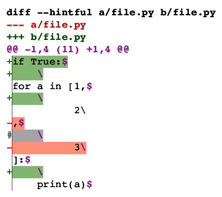
</picture>

Here, the diff tool detected two changes; the addition of an enclosing `if` block, and the removal of an array element.
The first change produces an indent increase for every line, even for the line that in the next change is deleted.
So, while the four spaces after `#` in the diff output exists in neither the old nor the new file, they do exist in an intermediate step, and are useful in visualizations for human consumption:

<picture>
  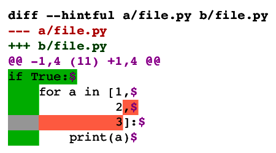
</picture>

But this is just one possible use for it.
It can also be used to insert comments and explanations for the diff output, or even major reformatting.

Another use case is diffing minified script files, where all the code is on one line.
We don't tend to do that because our tools are lacking, but with this format it'd be quite doable.
The syntax-aware diff tool could, as an intermediate step, reformat the code to its heart's content, inserting newlines and spaces to make it look nice.
For example, here's a visualization of a diff between two minified JavaScript files:

<picture>
  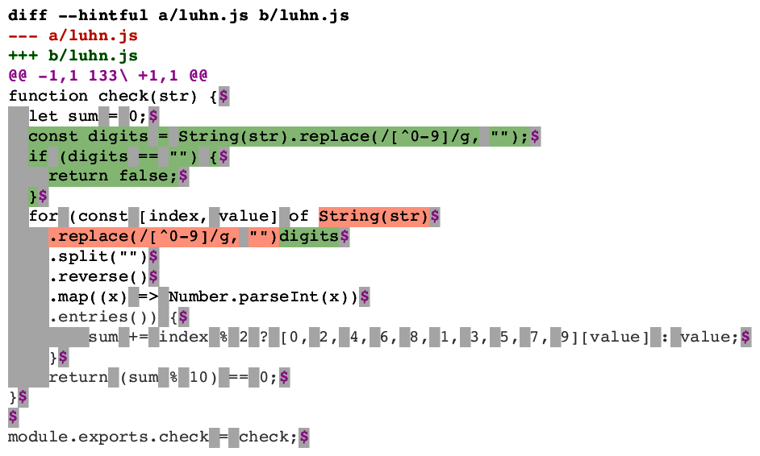
</picture>

You see a meaningful diff with a familiar code layout and can grasp the change quite easily.
Yet, the diff is unambiguous, true to the original and usable as a patch.
Content lines with the hash status marker are visualized with grey background, so you know that isn't present in either old or new file.

Note that the visualization tool can be generic and dumb; it needs no diff algorithm or syntax awareness.
Only the diff tool needs to be aware of JavaScript syntax.

The hash (`#`) character is probably the one with the most established tradition for the meaning "human-only consumption".
While in this case it technically will be processed by visualization tools, the hash character will probably still be the easiest to remember.

### Status marker underscore (`_`)

Consider again the example above with a diff of minified JavaScript.
Everything is on one line, so the unified diff would be quite unhelpful:

<picture>
  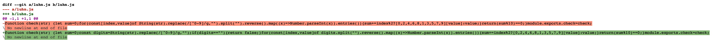
</picture>

Since a hintful hunk can only begin and end where a unified hunk can begin and end, a hintful diff must also include all content.
This presents two problems:
* Unified diff format has a certain number of context lines that patching tools use to find the correct place in a file to make changes.
  Tools differ in exactly how this is handled, but for example `git` will not apply a patch if the context lines do not match those in the patch.
  If all unchanged content becomes patch context, patching can become more stringent than desired, i.e. cause unnecessary merge conflicts.
* Human consumption is also hindered by a lack of focus on the changes.

To address these two issues, hintful diff format has the underscore status marker.
It indicates unchanged content that is *not* patch context.
You can think of it as declaring a delimiter between "virtual" hunks, i.e. delimiting changes that happen to have too few newlines between them to be split into individual hunks.

This will allow patching tools to differ between patch context and non-context content included for technical reasons.
However, they may also treat the underscore just like space (and thereby opting to suffer the downside of more frequent merge conflicts).
Visualization tools can interpret it as an indication that this context is less important.
In the following visualization, content marked with underscore is displayed as grey text:

<picture>
  
</picture>

And here is the raw diff file:

<picture>
  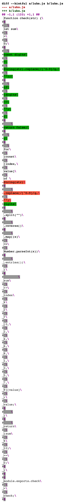
</picture>

The underscore (`_`) character has some established tradition for substituting space.
For this reason, it will probably be the easiest to remember.

### Newline handling

One of the main features of hintful format is the backslash (`\`) and dollar sign (`$`) newline markers at the end of content lines.
This is what will enable diff tools to express themselves more exactly.

Its placement at the end of the line (except sometimes before CR characters) may seem a bit awkward.
It's probably the least bad option, for several reasons:
* CR characters before the backslash (`\`) newline marker are part of the content, while CR characters after it are not.
  If the newline marker was not at the end, some other method would have to be devised to tell them apart.
* The backslash (`\`) and dollar sign (`$`) characters are probably the ones with the most established tradition for the meanings they are used in here.
  This tradition dictates that they should be at the end.
* The newline markers indicate something about the newline, so putting them at the end of the line makes for more localized meaning.
* When diffing indent sensitive languages, content lines that represent only part of a code line will frequently have trailing whitespace.
  Putting the newline marker at the end clears up that visual ambiguity.
  As an added bonus, this happens even for actual trailing whitespace, which is an improvement over unified diff.
* Putting the newline marker first would break existing syntax highlighting for diff formats more than necessary.

Despite all advantages, the newline marker does add some complexity.

First, it really is a kind of escaping since a newline in content is represented by a dollar sign (`$`) followed by newline.
It would certainly have been possible to have no escaping at all, but then the diff format could not be line-based.
Hintful diff format is designed as a line-based format to represent non-line-based content, in order to achieve good readability and retain the best parts of unified diff format.

Second, handling CR (`\r`) characters isn't trivial.
Unified diff format is transparent with regard to DOS/UNIX line ending conversion.
That is, adding a CR (`\r`) character before every LF (`\n`) character in both content and diff file, then patching the content using the diff file, then removing a CR (`\r`) character before every LF (`\n`) character in the resulting content, results in the same content as just applying the diff file.
It is in order to retain this feature, that it is required that any occurrence of a `\r*\n` sequence in effective content be represented by a `\r*\n` sequence in the hintful diff format file.
This implies that
* No CR (`\r`) character may be located immediately before a dollar sign (`$`) newline marker.
* A CR (`\r`) character may be located immediately before a backslash (`\`) newline marker only if it is not part of a `\r*\n` sequence in effective content.

In order to simplify the format:
* Snippet names must not contain `\r`.
* Producers must not, but consumers may, use the syntax `\ No newline at end of file` as used in unified hunks.
  It is merely a special case of the backslash newline marker, and therefore there is no need to keep it.

If a hunk contains only line-based changes it may be easier on the eyes to exclude the newline markers.
This can be done in two ways:
* Use unified hunk format. This also precludes use of snippets.
* Use hintful hunk format but exclude the backslash (`\`) from the hunk header. This still allows using snippets.

### Named snippets

Snippet lines are used to activate and deactivate named snippets.
Named snippets are used to express refactoring, including code movement and copying.
These are very common operations, and having a diff format that can express them would be highly desirable.
It would for example allow tools for diffing and merging to evolve independently, and then compose into a solution that can merge a lot more advanced code changes than the mainstream toolchains of today:
* A language-specific diff tool aware of syntax and semantics can express how code is refactored.
* A language-independent merge tool can hopefully be deviced to pay attention to named snippets with no regard for syntax, apply merged changes to the named snippets and resolve those changes to the correct place(s) in the code.

The only thing speaking against a native notation for refactoring is the design goal of simplicity, in understanding and implementation.
The named snippet functionality strikes a good balance between simplicity and expressive power, and hopefully the added complexity won't prevent adoption.
As demonstrated in the reference implementation, it is quite simple to convert this format to unified diff format with access only to the patch file, and in the process remove all snippet information.

The named snippet functionality seems to fulfill all the design goals well.
* Similarly to unified diff, only a single pass is necessary to patch or reverse patch.
  This makes it rather simple to implement.
* Mental parsing is probably as easy as it could be.
  It's not fair to compare it to the simpler syntax of unified diff, since with that format you won't get any help at all to identify refactoring.
  It is a slightly more complicated syntax, but should be a lot more helpful in total.

Named snippets are not necessarily found as-is in either the old or new file.
Similarly to the hash (`#`) status marker, named snippets is a way to talk about an intermediate form that aids expression and understanding.
This enables several new use cases:
* It provides a generic, simple way to express both simple and complicated refactoring.
  For example, a common expression that is refactored into a variable can be expressed with two named snippets, one for the variable name (`N`) and one for the expression (`E`).
  The variable definition is added to the new file with the variable name also found in the varable name snippet (`N`), and the expression in the expression snippet (`E`).
  At every location where the common expression is replaced with a variable reference, first the expression is shown to be found in the old file and the expression snippet (`E`), then the variable reference is shown to be present in the new file and the variable name snippet (`N`).

  <picture>
    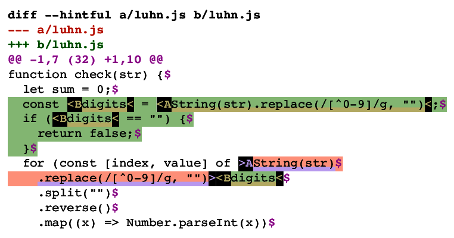
  </picture>
* It's probably possible to express 3-way or n-way diffs using only hintful diff format and a set of conventions.
* One and the same diff format file could express a series of changes to the same code, by using a series of interlinked snippets to represent intermediate states.
  This could be used by an advanced diff tool to express several AST changes whose code happen to overlap, in a more legible way.
  Similarly, it could be used to express an entire set of patches that can then be viewed in context.
  Example:

  <picture>
    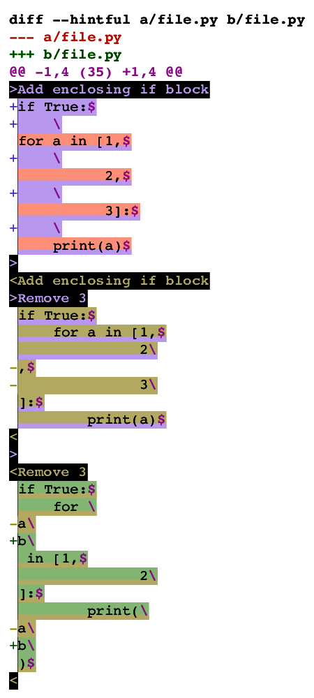
  </picture>

  And here, the same thing visualized:

  <picture>
    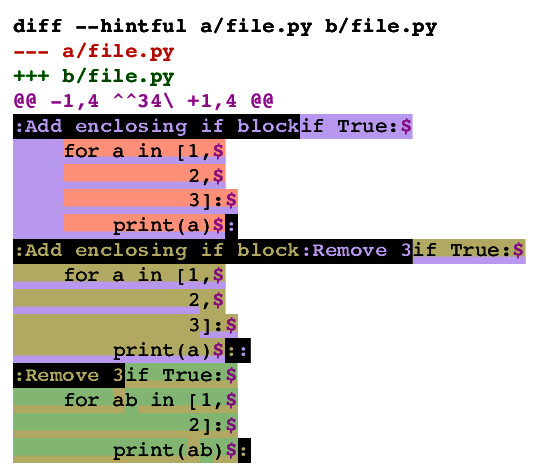
  </picture>
* `git diff` can already infer and output renaming of files, which is a special case of communicating a relationship between one deletion and one addition.
  Named snippets offer a way to express relationships between arbitrary changes.
  Refactoring happen with much finer granularity than file-level.

This design also makes sure to keep the following two properties of unified diff format:
* A symmetry that makes it trivial to produce a reverse patch from any given patch.
* The size of the new tree is bounded by the sum of the old tree and the patch file.
  If we allowed "fast-forwarding" by allowing named snippets to continue and include content between hunks, we could get exponential data growth or memory use in terms of patch size, which is undesirable.

The six characters (`.=,^$:`) used to control named snippets are chosen with the aim to maximize ease of learning, mental parsing and machine parsing.
* The period (`.`) and comma (`,`), which means "not included" and "not changed", are chosen to be minimally interfering, to allow the reader to focus attention elsewhere.
* The set of characters used in snippet columns (`.=,^$`) are disjoint with the set of characters used in the status marker column (`-+ _#:`) so that the number of snippet columns is apparent on each individual line.
* The set of characters used in content lines (`.=-+ _#`) are disjoint with the set of characters used in snippet lines (`,^$:`) to make it easy to differentiate and discard either when visually searching along one column, or machine parsing with one-character peek.
* Even though snippet activation lines and snippet deactivation lines are already distinguishable based on the presence of a snippet name, they are again differentiated with caret (`^`) vs dollar sign (`$`) for added clarity and ability when parsing a single column.
* The six characters (`.=,^$:`) are chosen to avoid quote characters (``` "'\` ```), matched pairs (`()[]{}`) and characters that otherwise have special meanings in hintful or other diff formats (` !#$*+-<>@\_|`) with one exception:
  The dollar sign (`$`) is used both as a newline marker and for deactivating a snippet.
  Hopefully this is a good trade-off, since these two uses are in very different places, and there is no other character with comparable tradition for meaning "the end".
* Similarly to other characters with special meanings, they are all printable, non-alpha-numeric ASCII.
* Except for the unobtrusive characters (`.,`), care has been taken to select characters with matching traditional meaning.
  The equals sign (`=`) might not be spot on for content inclusion, but seems to be the character most easily remembered once learned.
  The caret (`^`) and dollar sign (`$`) have a long tradition of meaning "start" and "end", and the caret (`^`) is also sometimes used to define and use named references such as footnotes.
  The colon (`:`) also has some tradition for signifying a label to be referred to.

### Mixing hunk formats

The unified and hintful hunk formats can be mixed freely within a hintful diff format file.
This is to achieve backward compatibility:
A valid unified diff file is always a valid hintful diff file (except in a corner case explained below).

Example:

<picture>
  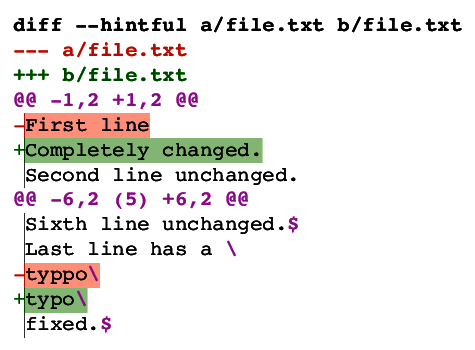
</picture>

### Prefixed file comparisons and compatibility

Backward compatibility means that new tools are compatible with old formats.
Forward compatibility means that old tools are compatible with new formats.

Backward compatibility is easily fulfilled since unified diff format is a subset of compat format, and compat format is a subset of hintful format.

Forward compatibility is more involved.
It should be possible to use e.g. the *current version* of `git apply` to apply a hintful patch.
This is the only purpose with prefixed file comparisons and compat format.

In order to make compat format a subset of the full hintful diff format, a hintful diff format file can include both prefixed file comparisons and unprefixed hintful hunks.
This way, consumers of the format will not need to distinguish between these two formats.

One might even choose to extend a consumer to read hintful format without distinguishing it from unified format.
This choice has a small price:
It would technically not be entirely backward compatible since it is possible to violate the rules for prefixed file comparisons and thereby create an invalid hintful diff that is still a valid unified diff.
This is however unlikely to have ever happened, since previously there has been no reason to create unified diff format files containing lines beginning with `|`.

Here's an example of a compat diff format file, highlighted.
Redundant hunks are shown in gray text, to help direct attention.

<picture>
  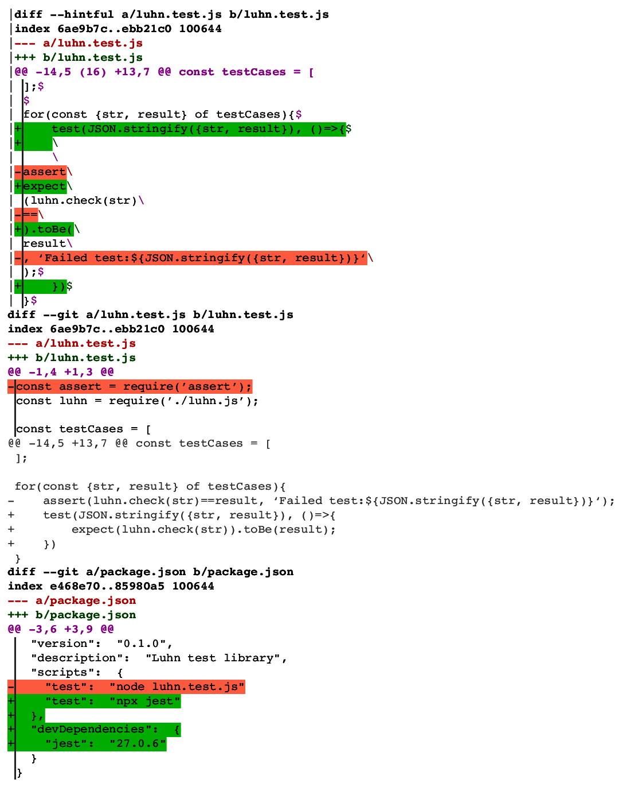
</picture>

The best way to visualize a compat diff format file is probably to first convert it to a hintful format file with no prefixed hunks:

<picture>
  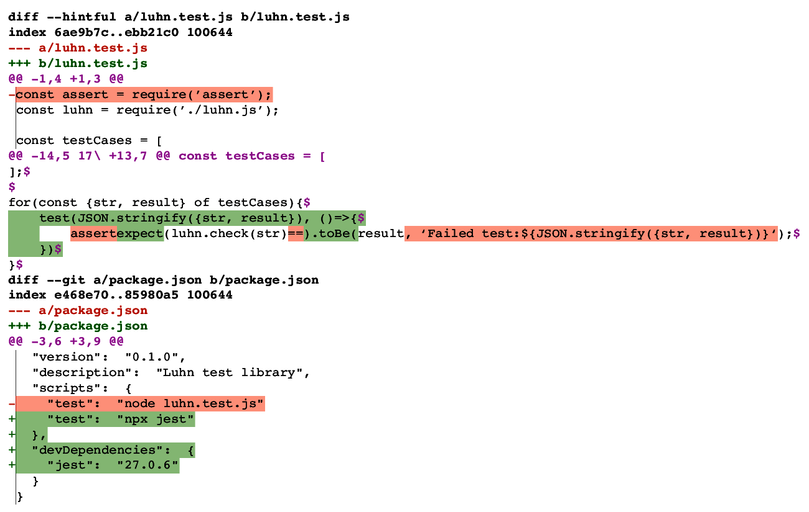
</picture>
