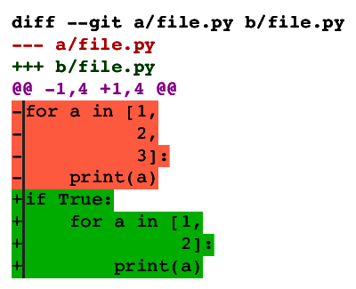
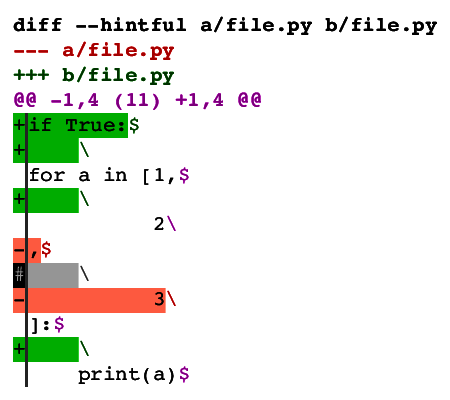
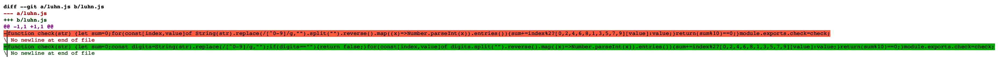
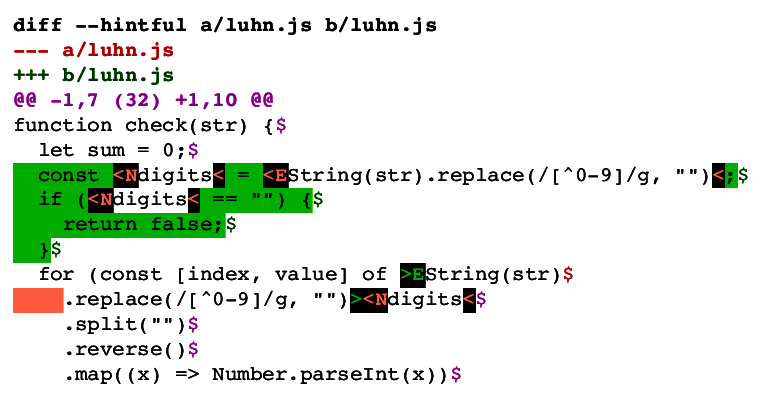

# Hintful diff format

Specification, reference implementations and test battery for Hintful diff format.

* The [MAIN.md](MAIN.md) file contains the specification, along with motivation.
* The [implementations/](implementations/) directory contains reference implementations for
  * Validating diff files in, reversing diff files in, and converting diff files from/to compat, hintful and unified formats.
  * Producing diff format files in hintful and unified formats (by calling out to `git diff`).
  * Consuming diff format files in unified format (by calling out to `git apply`).
* The [tests/](tests/) directory contains tests for the implementations in `implementations/`.

# Why?

Today's diff formats aren't good enough.
They lack:
* Good support for **non-line-based content**, which is necessary to readably express many code changes.
* Good support for expressing **refactorizations**, which is necessary to enable composable, syntax-aware tooling.

Hintful diff format aims to address those issues in a both **forward and backward compatible** way, and with a **minimal complexity** increase.

## Support for non-line-based content

The following is a unified diff of a very simple code change:

<picture>
  
</picture>

In order to understand it you have to mentally compare the two versions, essentially running a diff algorithm in your head.
Many tools that view diff files help you out by using an internal diff algorithm to "refine" it.
Either way, you need a diff algorithm to make sense of the output from a diff algorithm.
That is pretty bad.
Here is a hintful diff format file of the same change:

<picture>
  
</picture>

Here you can see the changes at a glance, even though you lose sense of the horizontal code layout.
At least you don't have to do any mental diffing.
Now, take a look at how it's visualized:

<picture>
  
</picture>

This is understood at a glance.
It is also a dumb visualization, much simpler to implement than "diff refinement".

The above is meant as a good example of how current diff formats aren't good enough for regular activities, but support for non-line-based content enables new use cases such as diffing minified code.
A unified diff would look ridiculous:

<picture>
  
</picture>

But the same thing in a hintful visualization is quite readable:

<picture>
  
</picture>

See the [specification](MAIN.md#specification) for details.

## Enabling syntax-aware, composable tooling

There seems to have been many attempts over recent years and maybe decades to improve diff tooling to be more readable for humans, often by making them syntax-aware.[^difftastic][^diffsitter][^prettydiff]
These tools attempt to cover the whole pipeline:
Compare two versions of a tree, present the difference to the user in an easy to digest manner and allow changes to be applied/merged.
Despite all the nice features, that is not a composable tool.
Perhaps lack of composability is one reason why such tools fail at gaining widespread adoption?

[^difftastic]: [difftastic](https://github.com/Wilfred/difftastic)
[^diffsitter]: [diffsitter](https://github.com/afnanenayet/diffsitter)
[^prettydiff]: [prettydiff](https://prettydiff.com/)

Unified diff format has long been at the center of a set of composable tools that produce or consume this format.
There is `diff` and `git diff` to compare two versions of a tree and produce a diff-format file,
there are many UI tools to visualize ("refine"!) diff-format output for better human comprehension,
and there is `patch` and `git apply` to consume a diff-format file.

However, unified diff format cannot support syntax-aware diff tools because it doesn't allow such tools to describe their findings.
Hintful diff format aims to become the diff format at the center of both traditional and such advanced tooling, by being
1) forward and backward compatible with unified diff format.
2) syntax-agnostic.
3) usable for patching, reverse patching and merging.
4) effortlessly inspectable by humans.
5) suitable to express changes with a finer granularity than one line of code.
6) expressive enough for common code change operations such as renaming, moving and refactoring.
7) simple to understand.

This requires a new diff format, since
* As demonstrated above, unified diff format fails at points 4, 5 and 6.
* Point 4 and 5 are fulfilled by `git diff --word-diff`, but that instead fails point 3 and 6.
* Point 6 isn't supported by any popular diff format.

## Support for renaming, moving and refactoring

The git version of unified diff format already supports renaming files, but no code movement of finer granularity can be expressed.

Hintful diff format has a feature called *named snippets*, which is a way to connect arbitrary sections of code on either side of the comparison.
It is a simple but powerful feature that can be used to author any kind of variable renaming, code movement or refactoring.
A simple example follows:

<picture>
  
</picture>

There are two named snippets here.
Snippet `A` connects code added at one place with code removed from another place, effectively expressing a code movement.
Snippet `B` connects three equal additions, thereby stating explicitly that they are the same thing.

See the [specification](MAIN.md#specification) for details.

# How to help

You can help by opening and discussing [issues](https://github.com/svenssonaxel/diff-format/issues) about
  * Inconsistencies, bugs, unclear or incomplete documentation
  * Potential problems or weaknesses, even if you don't have a better idea
  * Advantages and drawbacks of the design choices.
    These should also be summarized in the [Motivation section in MAIN.md](MAIN.md#motivation).

# Roadmap

## Step 1: Reach beta quality

**This is where we are currently**

Critique hintful diff format as soon as possible so that it doesn't get finalized with an inherent problem.
If you suspect a potential problem, open an [issue](https://github.com/svenssonaxel/diff-format/issues) even if you're not sure or don't have a solution.

## Step 2: Tool implementation trial and finalization

After the beta is released, implement the format in your project in a non-production branch/release.
We'd like a couple of different producers and consumers to try it out and reveal as many remaining problems as possible.
This experience is used to finalize the format.

## Step 3: Tool implementation

After the format is finalized, implement it in your project and feel free to release it.

For producers such as `diff`, `git diff` and semantic diff tools you could for example
* Add two CLI flags, one for hintful format and one for compat format, **or**
* Change your tool to produce compat format by default, with a flag to switch to hintful format.

For consumers such as `patch`, `git apply` and diff visualizers, you could for example
* Extend your tool to accept hintful format since it is (almost) a superset of unified diff format, **or**
* Add a CLI flag to accept hintful format.

A plausible road to widespread adoption looks something like this:
* Tools with an inherent need for features of hintful diff format, such as semantic diff and visualization tooling, implement the format immediately.
  Producers will probably use compat format by default.
* After some years of establishing and validating the usefulness of the format, a few communities will hopefully begin a push to switch to hintful format that is not compatible with unified diff format.
  This push will probably be fuelled by the prospect of smaller diff/patch files that is nicer to read, and enabled by the possibility of using small tools to convert to unified diff format to interact with legacy tooling.
* After some years of an increasing number of communities using hintful diff format in this way, legacy tooling with less inherent need for the features of hintful diff format (such as git), implement it due to popular demand ("No more aliasing `git apply-hintful`, and the new `git diff --word-diff --hintful` produces viable patches!").
* After legacy tooling supports hintful diff format, new tools with no history to be backward compatibile with can plausibly implement hintful diff format only, or at least use it as default.
